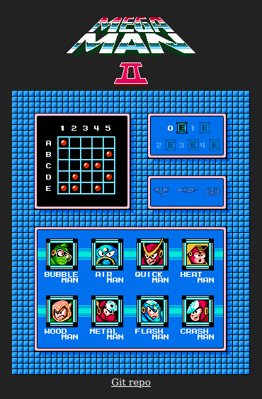

# Megaman2

[Check it out](https://bugtamer.github.io/megaman2/)

- See [Megaman](https://github.com/bugtamer/gb-megaman) (Game Boy) Password generator

## Table Of Content

- [Password generator](#password-generator)
  - [Default password](#default-password)
  - [Boss codification based on the number of E-tanks](#boss-codification-based-on-the-number-of-e-tanks)
- [Requirements](#requirements)
- [Install and run](#install-and-run)
- [Docker](#docker)
  - [Build](#build)
  - [Run](#run)
- [Github page deployment](#github-page-deployment)
  - [Add dependency](#add-dependency)
  - [Deploy](#deploy)
- [To Do](#to-do)
- [Info](#info)

## Password generator

- Each password has 9 coordinates.
- It stores the number of E-tanks available and whether each of the 8 bosses was defeated or not.

### Default password

`['A1', 'B5', 'C3', 'C4', 'D2', 'D5', 'E1', 'E2', 'E4']`

- 0 E-Tanks
- 0 Defeated bosses

|   | 1 | 2 | 3 | 4 | 5 |
| - | - | - | - | - | - |
| A | * |   |   |   |   |
| B |   |   |   |   | * |
| C |   |   | * | * |   |
| D |   | * |   |   | * |
| E | * | * |   | * |   |

### Boss codification based on the number of E-tanks

- :robot: = Alive
- :coffin: = Dead

| Boss name | Item   | :robot: | :robot: | :robot: | :robot: | :robot: | :coffin: | :coffin: | :coffin: | :coffin: | :coffin: |
| --------- | ------ |:-------:|:-------:|:-------:|:-------:|:-------:|:--------:|:--------:|:--------:|:--------:|:--------:|
| # E-Tanks |        |    0    |    1    |    2    |    3    |    4    |     0    |     1    |     2    |     3    |     4    |
| E-Tank    |        |   A1    |   A2    |   A3    |   A4    |   A5    |    A1    |    A2    |    A3    |    A4    |    A5    |
| Airman    | Item-2 |   E3    |   E4    |   E5    |   B1    |   B2    |    D2    |    D3    |    D4    |    D5    |    E1    |
| Bubbleman |        |   D1    |   D2    |   D3    |   D4    |   D5    |    C3    |    C4    |    C5    |    D1    |    D2    |
| Crashman  |        |   C5    |   D1    |   D2    |   D3    |   D4    |    E2    |    E3    |    E4    |    E5    |    B1    |
| Flashman  | Item-3 |   C1    |   C2    |   C3    |   C4    |   C5    |    E4    |    E5    |    B1    |    B2    |    B3    |
| Heatman   | Item-1 |   B2    |   B3    |   B4    |   B5    |   C1    |    D5    |    E1    |    E2    |    E3    |    E4    |
| Metalman  |        |   E5    |   B1    |   B2    |   B3    |   B4    |    E1    |    E2    |    E3    |    E4    |    E5    |
| Quickman  |        |   B4    |   B5    |   C1    |   C2    |   C3    |    C4    |    C5    |    D1    |    D2    |    D3    |
| Woodman   |        |   D3    |   D4    |   D5    |   E1    |   E2    |    B5    |    C1    |    C2    |    C3    |    C4    |

- Item-1: levitating platform
- Item-2: jet sled
- Item-3: crawling platform

## Requirements

- Node.js 18.10
- Angular 15

## Install and run

- Within the project folder:
- `npm i`
- `ng serve -o`

## Docker

### Build

`docker build -t bugtamer/megaman2 .`

### Run

- `docker run -d -it -p 80:80/tcp --name megaman2 bugtamer/megaman2:latest`
- http://localhost

## Github page deployment

`npm run ghpages`
Commit and push changes

### ~~Add dependency~~

~~`ng add angular-cli-ghpages`~~

### ~~Deploy~~

~~`ng deploy --base-href=/megaman2/ --message="vX.Y.Z"`~~

## To Do

- [ ] FIX blinking boss effect after touching an unselected boss on touch screen.
      It stops when the blinking boss looses its focus or it is unselected.
- [ ] FIX blinking item effect after touching an item on touch screen.
      It only stops when the blinking item looses its focus.
- [ ] RELEASE a new patch version.
- [ ] IMPROVE eTanks layout: alignment, margins, etc.
- [ ] IMPROVE item layout: vertical alignment, margins, etc.
- [ ] RELEASE a new minor version.
- [ ] ADD PWA features.
- [ ] RELEASE a new major version.
- [ ] Keep dependencies up to date.

## Info

- Bisqwit. [Mega Man 2 ※ Cracking Videogame Passwords S1e1](https://www.youtube.com/watch?v=0eQyYrSQPew). (2020-07-19)
- Scykoh. [Mega Man 2 - Glitchfest](https://www.youtube.com/watch?v=koTEUbNwv9w). (2020-07-19)
- GameFAQs. [Mega Man 2 – Cheats](https://gamefaqs.gamespot.com/nes/563442-mega-man-2/cheats). (2023-01-28)
- [angular-cli-ghpages](https://github.com/angular-schule/angular-cli-ghpages)
- [Angular README.md](./angular.md)
